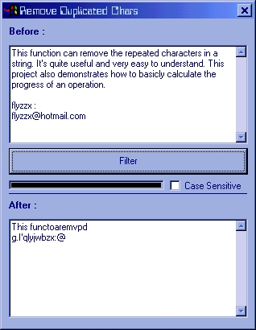



## \[ Remove Repeated Chars \]

### Description

This project demonstrates how to remove the repeated characters in a string. A progress bar is included so you can know the progress of the operation. Great for beginners. VOTE IT IF YOU LIKE IT! THANKS!
 
### More Info
 

             |
---                |---
**Submitted On**   |2002-07-07 08:21:40
**By**             |[flyzzx](https://github.com/Planet-Source-Code/PSCIndex/blob/master/ByAuthor/flyzzx.md)
**Level**          |Intermediate
**User Rating**    |4.2 (21 globes from 5 users)
**Compatibility**  |VB 6\.0
**Category**       |[String Manipulation](https://github.com/Planet-Source-Code/PSCIndex/blob/master/ByCategory/string-manipulation__1-5.md)
**World**          |[Visual Basic](https://github.com/Planet-Source-Code/PSCIndex/blob/master/ByWorld/visual-basic.md)
**Archive File**   |[\[\_Remove\_R102963762002\.zip](https://github.com/Planet-Source-Code/flyzzx-remove-repeated-chars__1-36665/archive/master.zip)

